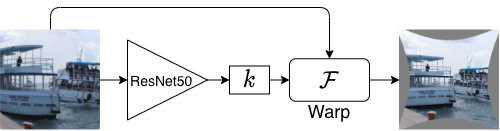

# WAIR
## Introduction
This repository contains the dataset, code and test results for the baseline method proposed in paper [Wide-angle Image Rectification: A Survey](). Based on three types of distortion models, i.e., the FOV model (FOV for short), the one parameter division model (DM for short) and the equidistant model (ED for short), and three open-source datasets, i.e., the ADE20k dataset, the WireFrame dataset and the COCO dataset, totally nine syntheized datasets are generated. Each dataset is named after the distortion model it used and the original dataset that the standard images are borrowed from. For example, if a dataset is synthesized based on ED model using the standard images from COCO dataset, it is named as a ED COCO dataset. 

The architecture of the deep network is illustrated below. 

The network is based on [ResNet50](), Which is pretrained on ImageNet. The output of the network is the regressed distortion parameter $k$, and then the warp module taking the distorted image and parameter $k$ as input, outputs the corrected image. It is a one-stage method and post-processing is not needed. The deep model is named after the synthesized training dataset it trained on. For example, if a deep model is trained on DM WireFrame dataset, it is a DM WireFrame deep model or DM WireFrame model for short. Here we trained three deep models, i.e., the FOV ADE20k model, the DM ADE20k model, and the ED ADE20k model, and tested each one on all the nine synthesized dataset. The weights for each model can be downloaded via the link listed below.  Since they are all trained on ADE20k dataset, we call them FOV model, DM model andn ED model instead.

| FOV ADE20k model | DM ADE20k model | ED ADE20k model |
| :----:| :----: | :----: |
|    [weights]()   | [weights]()       |   [weights]()     |

## Test Results
For each 

### Test on ADE20k dataset 
|      |	FOV   |	DM     |	ED    |
| ----:| :----: | :----: | :----: |
|**FOV**|	 26.43/0.85|	16.65/0.45|	18.84/0.54|
|**DM**|	 21.034/0.63|	24.76/0.81|	25.48/0.83|
|**ED**|	 18.83/0.56|	23.37/0.75|	26.01/0.84|

The visual results are shown [here](./results/ADE20k.md)

### Test on WireFrame dataset
|	|FOV|	DM |	ED|
| ----:| :----: | :----: | :----: |
|**FOV**|	26.45/0.86|	16.65/0.51|	19.06/0.61|
|**DM**|	21.02/0.68|	25.10/0.83|	25.32/0.84|
|**ED**|	19.02/0.63|	23.77/0.79|	25.83/0.85|

The visual results are shown [here](./results/WireFrame.md)

### Test on COCO dataset
|	|FOV|	DM|	ED|
| ----:| :----: | :----: | :----: |
|**FOV**|	25.91/0.84|	16.09/0.43|	18.51/0.53|
|**DM**|	20.43/0.61|	24.00/0.79|	24.83/0.81|
|**ED**|	18.50/0.55|	22.73/0.74|	25.45/0.83|

The visual results are shown [here](./results/COCO.md)

### More test results for DM model on ADE20k, WireFrame and COCO dataset
| ADE20k | WireFrame | COCO |
| :----:| :----: | :----: |
|  |  |  |
|  |  |  |
|  |       |       |

### Test on real fisheye video dataset

      
                      
                     

